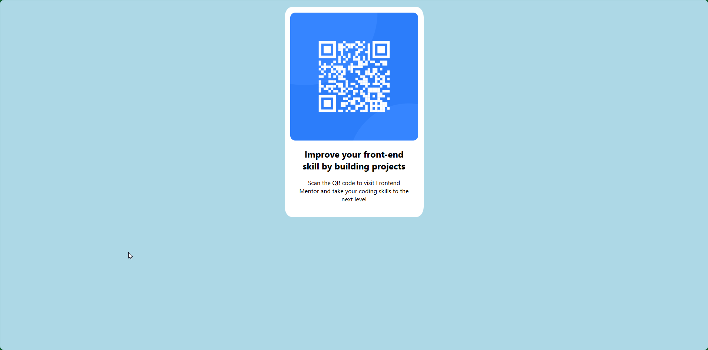

# Frontend Mentor - QR code component solution

This is a solution to the [QR code component challenge on Frontend Mentor](https://www.frontendmentor.io/challenges/qr-code-component-iux_sIO_H). Frontend Mentor challenges help you improve your coding skills by building realistic projects. 

## Table of contents

- [Frontend Mentor - QR code component solution](#frontend-mentor---qr-code-component-solution)
  - [Table of contents](#table-of-contents)
  - [Overview](#overview)
    - [Screenshot](#screenshot)
    - [Links](#links)
  - [My process](#my-process)
    - [Built with](#built-with)
    - [What I learned](#what-i-learned)
    - [Useful resources](#useful-resources)
  - [Author](#author)

**Note: Delete this note and update the table of contents based on what sections you keep.**

## Overview
QR component created in REACT for frontendmentor challenge

### Screenshot

### Links

- Solution URL: [Add solution URL here](hhttps://github.com/pifej/qr-code-component-react)

## My process

### Built with

- [Next.js](https://nextjs.org/) - React framework
- [Styled Components](https://styled-components.com/) - For styles

### What I learned

CSS way of containing data. How padding and margin behaves.

### Useful resources

- [Example resource 1](https://web.dev/learn/css) - This helped me to learn the basics.

## Author

- Peter Meszaros
- Frontend Mentor - [@pifej](https://www.frontendmentor.io/profile/yourusername)
